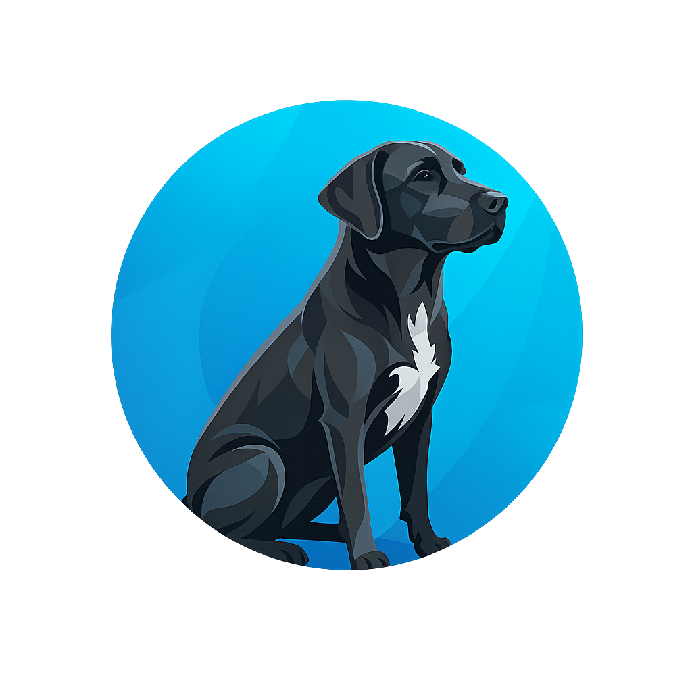

# Hi, I'm Matias Marzorati 👋

📍 **Buenos Aires, Argentina** | 💼 **Software Engineer at Tesacom**

> Full Stack Developer with 3+ years of experience, strong focus on backend architecture and scalable APIs. Specialized in microservices, distributed systems, and cloud infrastructure. Currently studying Software Engineering at Universidad de Belgrano.

## Current Projects

-  **[Timo](https://soytimo.com)** – Insurance policy management app with AI chatbot
-  **[Hábitat Conecta](https://habitatconecta.com)** – Entrepreneurship platform connecting 250+ businesses
-  **Ghost-Guardian** – Network-level parental control system

## Experience

-  **[Tesacom](https://www.tesacom.com.ar)** – SSr Software Engineer *(Current)* — Microservices with Moleculer & Node.js
-  **[Mazzo Developments](https://github.com/mazzodevelopments)** – Co-Founder | Lead Backend Architect
-  **[Instituto de Seguridad Pública](https://www.issp.gov.ar)** – FullStack Developer — Internal systems in Java & PHP

## What I'm Doing

- **Building my own products** — Timo, Ghost-Guardian and more in the pipeline
- **Scaling microservices at Tesacom** — Distributed systems with Moleculer & Node.js
- **Studying Software Engineering** — Universidad de Belgrano
- **Studying AI Engineering** — Building expertise in AI-powered systems

## Connect

